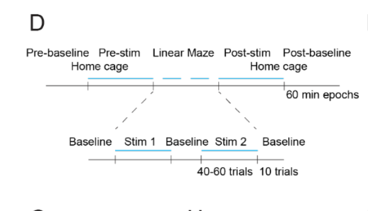
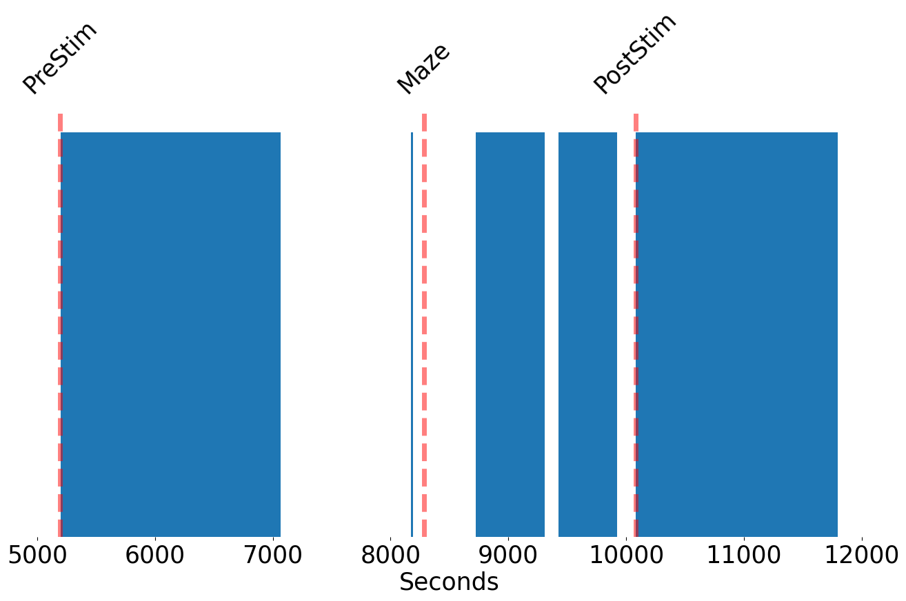

# Notes
The following notes are taken from the paper and the supplementary material.
They are intended to clarify some of the decisions of the conversions and should work as a reference for the conversion and discussion and the authors.

## References
The article text can be found in the following links:
*  [Free access](https://www.ncbi.nlm.nih.gov/pmc/articles/PMC9632609/)
* [Supplementary Materials](https://www.ncbi.nlm.nih.gov/pmc/articles/PMC9632609/bin/NIHMS1804419-supplement-Supplementary_Material.pdf)
* [In science](https://www.science.org/doi/10.1126/science.abm1891)

Information about recording devices:
* [probe](https://www.neurolighttech.com/product). By their description, they use the chronic variety.
* [paper](https://doi.org/10.1016/j.neuron.2015.10.032)

Peter Petersen, one of the members of the Buzsaki lab, has shared with us the following documents that contain the structure of the cell explorer format:

* [new format](https://cellexplorer.org/data-structure/)
* [old format](https://github.com/buzsakilab/buzcode/wiki/Data-Formatting-Standards)

The data in Globus is in the following link:
* [valero data in globus](https://app.globus.org/file-manager?origin_id=188a6110-96db-11eb-b7a9-f57b2d55370d&origin_path=%2FValeroM%2F)

Relevant links in github:
* [main issue](https://github.com/catalystneuro/buzsaki-lab-to-nwb/issues/54)


## Important information in the paper


### Electrodes and recording devices


Animals were implanted with 32-site, 4 shank μLED probes ((15); Neurolight, MI) over the dorsal right
hippocampus (antero-posterior 2.0 mm, mediolateral 1.5 mm, dorsoventral 0.6 mm), as described
previously (44, 45).

This are the optical probes they use
https://www.neurolighttech.com/product

The fact sheet of thei probes is a good source of info:
https://www.neurolighttech.com/_files/ugd/63a305_28d96686c0ec4cc18b728b2c5c9b7d78.pdf

In particular, we know they use an `Intan RHD2132 Amplifier Board`. This is a 32 channel amplifier.

https://intantech.com/products_RHD2000.html

I think this is what it is described as the recording headstage here:
https://intantech.com/RHD_system.html

But then over there there is also a controller. And they are using this one according to `session.mat`.
Intan Technologies, RHD2000 USB interface board (256ch)

https://intantech.com/RHD_USB_interface_board.html

Juding by the description in the paper, they were using the chronic variety:

> Probes were mounted on microdrives that were advanced to CA1 pyramidal layer in small increments over 5 to 8 days,
while depth distribution of LFPs (SPW-R events and theta oscillations) and unit firing were used
to identify CA1 pyramidal layer. After implantation, all animals were housed individually

Now according to the fact sheet, the lasers are connected to an `18-pin polarized Omnetics (PZN-18-AA, bottom)`. And according to `session.mat` we have the following information:
```
   "analysisTags": {
      "probesLayout": {
        "type": "<class 'str'>",
        "value": "poly2"
      },
      "probesVerticalSpacing": {
        "type": "<class 'int'>",
        "value": "10"
      },
      "digital_optogenetic_channels": {
        "type": "<class 'numpy.ndarray'>",
        "shape": "(6,)",
        "value": "[11 12 13 14 15 16]"
      },
      "analog_optogenetic_channels": {
        "type": "<class 'numpy.ndarray'>",
        "shape": "(6,)",
        "value": "[3 4 5 6 7 8]"
      },
      "bazler_ttl_channel": {
        "type": "<class 'int'>",
        "value": "1"
```
So I know which channels are but what is missing is the wiring with respecto the micro LEDs. This is probably in the arduino board described in the paper but I can't find the information here:
https://github.com/valegarman

The suplementary material claims that the arduion code should be there but it does not seem to exists:

> Water delivery and optogenetic stimuli during track were controlled by a custommade, Arduino-based circuit (circuits and software are available in https://github.com/valegarman).

### LFP
> . Electrophysiological data were acquired using an Intan
RHD2000 system (Intan Technologies LLC) digitized with 30 kHz rate. The wide-band signal
was downsampled to 1.25 kHz and used as the LFP signa

The LFP sampling rate should be 1.25 KhZ

### Optogenetics
> we recorded and probed large numbers of CA1 pyramidal neurons simultaneously in freely moving calcium/calmodulin–dependent protein kinase II alpha (CamKIIα) -Cre::Ai32 mice

### Intracellular recording

There should be 4 sessions with intracelluar recordings. They are described in the paper as follows:

> Mice (n=4) were implanted with titanium head plates (41) and 50-μm stainless steel ground
wire was implanted between the skull and dura over the cerebellum. A ~200 µm diameter
craniotomy was made, and the dura was removed over dorsal hippocampus (antero-posterior 2.0
mm, mediolateral 1.5 mm). The craniotomy was covered with Kwik-Sil (World Precision
Instruments) until the day of recording. Mice were habituated to head fixation over one week and
were allowed to run on top of a 15 cm diameter wheel during fixation. On the day of recording,
the Kwik-Sil was removed, and sharp pipettes were pulled from 1.5 mm/0.86 mm outer/inner
diameter borosilicate glass (A-M Systems) on a Flaming-Brown puller (Sutter Instruments) and
filled with 1.5 M potassium acetate and 2% Neurobiotin (wt/vol, Vector Labs). In vivo pipette
impedances varied from 40-90 MΩ. Intracellular recording were performed blindly, and the
micropipette was driven by a robotic manipulator (Sutter MP-285). Signals were acquired with
an intracellular amplifier (Axoclamp 900A) at 100× gain.

### Behavior

Paper description:
> Animals were housed on a 12-hour reverse light/dark cycle, and the recording session
started 1-2 hr after the onset of the dark phase. We recorded from the mice while they slept or
walked around freely in the home cage. Electrophysiological data were acquired using an Intan
RHD2000 system (Intan Technologies LLC) digitized with 30 kHz rate. The wide-band signal
was downsampled to 1.25 kHz and used as the LFP signal.

I wonder if they have sleep vs awake as epochs of if they are different sessions.

> The animal’s position was monitored
with a Basler camera (acA1300-60 gmNIR, Graftek Imaging) sampling at 30Hz to detect a headmounted red LEDs.
Position was synchronized with neural data with TTLs signaling shutter position. Animals were handled daily and accommodated to the experimenter, recording room
and cables for 1 week before the start of the experiments.

So, there is a TTL and there is a camera. After some digging, I found that there is an `.avi` file located inside another directory and a corresponding `.mat` file.

> Water access was restricted and was
only available as reward on a linear track, ad libitum for 30 minutes at the end of each
experimental day and ad libitum for one full non-experimental day per week. Mice were trained
to run laps in a PVC linear track (110 cm long, 6.35 cm wide) to retrieve water reward (5-10µL)
at each end. Water delivery and optogenetic stimuli during track were controlled by a custommade, Arduino-based circuit (circuits and software are available in
https://github.com/valegarman).

Information about behavioral task

> For a typical recording session, mice were recorded  continuously for ~300 min through 6 experimental blocks (see Fig. S7D): pre track-baseline
(Pre-baseline, 60 min), Pre-track stimulation (Pre-stim, 60 min), Linear Maze task, post trackstimulation (Post Stim) and Post-track baseline. During track running, 3 baseline (nostimulation) blocks (10 trials each) were interleaved with two stimulation blocks (40 to 60 trials).

This figure S7D is useful for understanding the epochs:



# Questions
* Why are there two Tracking.Behaviors, the file is repeated in the folder that contains the video and in the top level.
* Why does this conversion combines data from the old and new format? We have both `sessionInfo.mat` and `session.mat`. I am puzzled by this.
* There is both kilosort and CellExplorer data. I think kilosort probably represents the final info to be added to the units table but probably should confirm this with the authors.
* They have a folder `revision_cell_metrics` that contains cell_metric data ordered by data. Same question as above.
* Are there 4 mice for interacellular recordings and 4 mice for extracellular recordings? I think so but I am not sure. Does this means that some sesions should be intracellular only? Can we identify those sessions by name?
* The organization of the folder structure in globus is cofusing. We have some sessions that are named `fCamk{number}` and I think they make sense. They refero to the optogenic protein / cell line. But I can't find the meaning of the following folder names and ctrl + f in the paper and the supplementy materials is not yielding any matches:
    * `fCr{number}`
    * `fld2Dlx{number}`
    * `Cck{number}`
    * `fNKx{number}`
    * `fPv{number}`
    * `fSst{number}`
    * `fVip{number}`
    * Plus a folder with `unindexed subjects`.
    In the `session.mat` the subject name apperas as `fCamk` so I could check if that's the case for the sessions with non-standard name.

* Is this a typo one the figure 1:
    > (M) Group results for five cells from five anesthetized rats (green) and five cells from four head-fixed mice (pink).

    I could not find mention of intracellular recordings in rats in the material and methods. Ah no, here it is:

    Quote from methods:
    > (M) Group results for five cells from five anesthetized rats (green) and five cells from four head-fixed mice (pink).

    So they do use another dataset for this from another paper.
* There are two tracking behaviors one on the top folder and another in the sub-folder. Do they indicate different experiments. So far, they seem to contain the same data.
*  in `session.mat` surgery there is actually a start time that matches 9 to 1pm. Four hours of surgery. I thought that that might be the whole session but that was 5 hours. So, I am not sure what the surgery time is.
* What is HSE? (Probably means high synchrony event)
* What is UDStates (Up and down states)
* What is ACG? (I think this is a correlogram)
* What does DigitalIn represents?
* What is pullTime?
* What is `ws_temp` ?
* For the sleep states, a decription of some of the theta waves would be useful:
```pyton
['WAKEstate',
 'NREMstate',
 'REMstate',
 'WAKEtheta',
 'WAKEnontheta',
 'WAKEtheta_ThDt',
 'REMtheta_ThDt',
 'QWake_ThDt',
 'QWake_noRipples_ThDt',
 'NREM_ThDt',
 'NREM_noRipples_ThDt']
 ```
I am wondering what is the `ThDt`.

## Synchronization and times

For session `fCamk1_200827_sess9`
* The video is 30 minutes long. And the corresponding mat file marks 53143 frames. This means that the video is sampled at 29.7 Hz.
* The auxiliary.dat files in the sub-folder with the movies are between 1 and 3 minutes. Not clear yet what they represent.
* LFP signal: It is 5 hours long using a sampling rate of 1.2 Khz.
* Raw signal: 5 hours of recording. This matches wit the 300 minutes of recording in the paper.
* Spiketimes:
* Timestamps for tracking behavior:
* Epochs:
    We shoud have something like this according to the paper:
    * Pre-baseline: 60 minutes
    * Pre-stim: 60 minutes
    * Linear Maze: 60 minutes
    * Post-stim: 60 minutes
    * Post-baseline: 60 minutes

    It is strange that the movie is only 30 minutes. Maybe they only turn it on at specific points, could have halved the frequency. Need to ask.
    The `session.mat` file has an epochs field describing the epochs. This indicates the the sub-folder for the Maze is named as the epoch.


| name                 |   startTime |   stopTime | behavioralParadigm   | environment   | manipulation     |   duration_hours |   duration_seconds |
|:---------------------|------------:|-----------:|:---------------------|:--------------|:-----------------|-----------------:|-------------------:|
| fCamk1_200827_084028 |        0    |    5194.88 | BaselinePre          | Home cage     | None             |         1.44302  |            5194.88 |
| fCamk1_200827_101538 |     5194.88 |    8284.64 | PreStim              | Home cage     | uLED random stim |         0.858267 |            3089.76 |
| fCamk1_200827_110712 |     8284.64 |   10081.4  | Maze                 | Linear maze   | uLED random stim |         0.499102 |            1796.77 |
| fCamk1_200827_113839 |    10081.4  |   11803.6  | PostStim             | Home cage     | uLED random stim |         0.478382 |            1722.18 |
| fCamk1_200827_125535 |    11803.6  |   17920.1  | BaselinePost         | Home cage     | None             |         1.69904  |            6116.54 |


From the table we can answer the question of how long is the behavioral epoch. Stop Time - StarTime = 10081.40 - 8284.64 = 1796.77 seconds = 29.94 minutes. This matches the length of the video. Moreover, we can see that the durations of the epoch is not as Fig S7D indicates. For this session:
* The baseline is 1.44 hours,
* The pre-stim is 0.85 hours
* The maze is 0.49 hours
* The post-stim is 0.47 hours and
* The post-baseline is 1.69 hours.


# Behavior data, intervals, events and epochs

The discussion here is for session `fCamk1_200827_sess9`

The `StartTime` on behavior trials is the trials intervals (start_time, stop_time)

For some reason the sessions ar

The tracking behavior mat file on the subfolder wit the camera has the dimensions for normalizing the position:

```
    "avFrame": {
      "r": {
        "type": "<class 'numpy.ndarray'>",
        "shape": "(1024, 204)"
      },
      "xSize": {
        "type": "<class 'numpy.ndarray'>",
        "shape": "(2,)",
        "value": "[ 0.     23.4396]"
      },
      "ySize": {
        "type": "<class 'numpy.ndarray'>",
        "shape": "(2,)",
        "value": "[  0.     117.6576]"
      }
    },
```

The tracking behavior in the top level `Tracking.Behavior.mat` has the following events:

```
    "events": {
      "subSessions": {
        "type": "<class 'numpy.ndarray'>",
        "shape": "(2,)",
        "value": "[ 8284.64       10081.40796667]"
      },
      "subSessionsMask": {
        "type": "<class 'numpy.ndarray'>",
        "shape": "(53143,)"
      }
    }
```

I think this is related to the two stimulus sessions in Fig S7D. OK, that's incorrect, I just compared and it is just the start and end of the behavioral epoch.


It seems that the trials cover all the behavioral epoch.
However, we also know that there is no stimulation on all of those trials. I wonder where I can get the times for the behavioral epoch of which there should be 5. Baseline - stim 1 - baseline - stim 2 - baseline.


In principle, we could get which trials have pulse from here.

#### Maps
I think that the maps just map the local timestamps to the gobal ones

```mat_file["behavior"]["maps"]```

This also applies for `noStimulatedMaps` and `stimulatedMaps` so no luck for getting the trials that are stimulated and unstimulated here.


# Pulses


There are 189 pulses. They cover the three central epochs:

Here is the figure



I am confused about something. For the session above the number of pulses is

```
pulses["timestamps"].shape
(42092, 2)
```

Which I can not square with the paper following claim:

> Stimulation protocol was delivered continuously during all
stimulation blocks: pre-track stimulation, post-tract stimulation and the two track running
stimulation blocks. ~20.000 pulses/site were delivered per session

This seems like the double. Does this means there are two sites, which ones?

The brain areas in the `session.mat` are:

```
    "brainRegions": {
      "CA1sp": {
        "channels": {
          "type": "<class 'numpy.ndarray'>",
          "shape": "(29,)"
        }
      },
      "CA1so": {
        "channels": {
          "type": "<class 'numpy.ndarray'>",
          "shape": "(5,)",
          "value": "[25 21 12  8  5]"
        }
      }
```

OK, so this matches. If I run:

```
first_group_of_channels = [25, 21, 12, 8, 5]
channel = pulses["analogChannel"]
np.isin(channel, first_group_of_channels).sum()
output: 20609
```
So, it is talking about brain area.

## EMG
There was EMG (Electromyography) but it seems that it was extracted from the LFP. There is a matlab file with it, should we add this?

Paper supplement Brain State Scoring section:
> EMG was extracted from
the intracranially recorded signals by detecting the zero time-lag correlation coefficients (r)
between 300-600 Hz filtered signals (using a Butterworth filter at 300 – 600 Hz with filter
shoulders spanning to 275 – 625 Hz) recorded at all sites (49).


## Channels from INTAN header:
